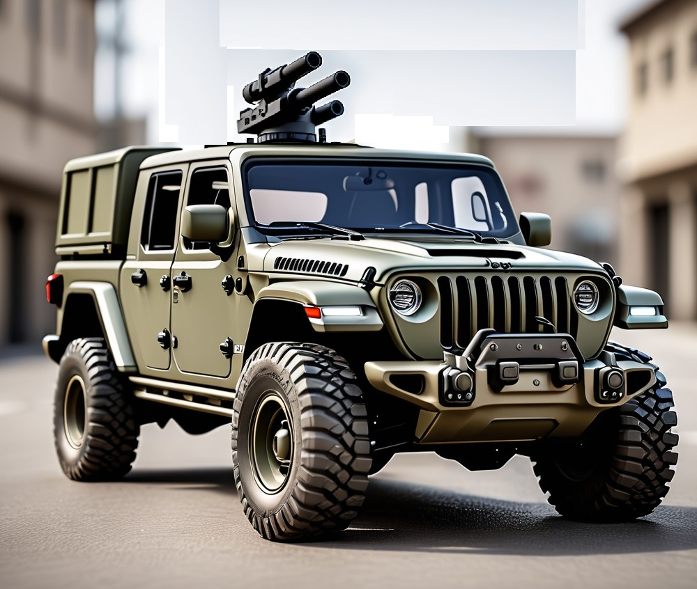
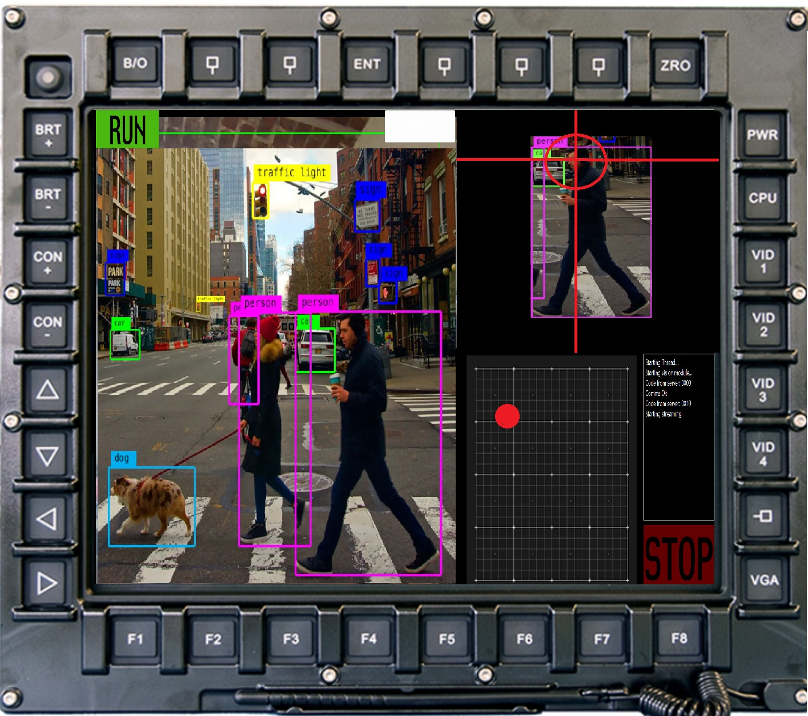
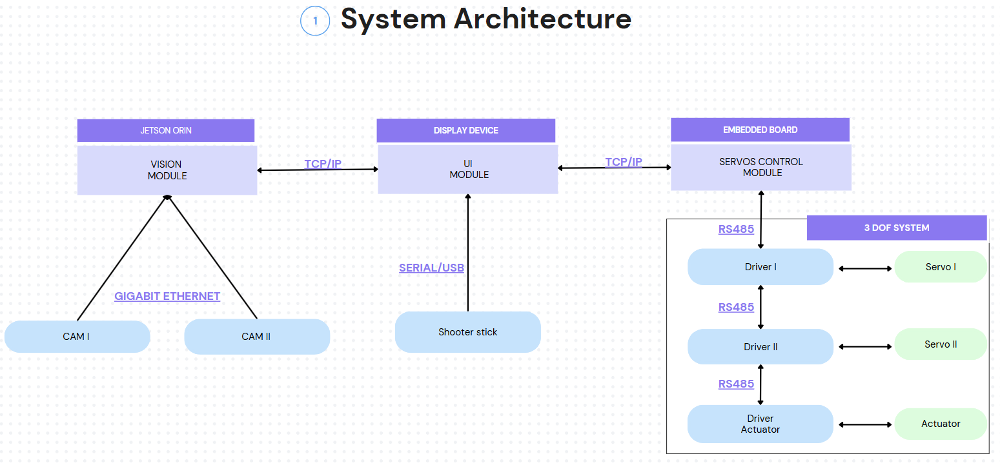

# Tutzil: Object detector and tracker for human assistance 


Tutzil is an advanced object detection and tracking system built upon the YOLOv8 model(more archtectures will be added later), integrated with a user interface created in Qt Creator that controls a 2DOF system.

|  |  |
|:--------------------------------:|:--------------------------------------------:|
| Concept Image                    | Concept Screen Image                          |

## Objectives

Basically this is an artificial vision system controlling a two-degree-of-freedom robot, where the user selects an object on the screen, and the robotic system autonomously adjusts the camera to accurately point at the chosen object. The primary goal of this project is to create a reliable and efficient tracking assistant that can be used mainly in a security system with a 2 DOF robot but also as a camera stabilizer, the goal of this project is to mount it in a vehicle.

## System Architecture 



## Vision Module - Jetson Orin/Nano

The vision module has been implemented on a separate device to maintain the autonomy of the UI system and to allocate the necessary resources for vision processing independently. Following this model, it will be easier to replace the embedded module with a more powerful system in the future, and it also allows for independent development of both the UI and vision modules.

### Frameworks


## Features

- **Object Detection**: Utilizes the YOLOv8 model (different architectures will be added later)for accurate and efficient object detection, pose estimation and segmentation.
- **Real-Time Tracking**: Tracks detected objects in real-time, ensuring smooth and responsive operation.
- **User Interface**: A user-friendly interface built with Qt Creator, providing easy control and visualization.
- **Pan and Tilt Control**: Integrates with a two-degree-of-freedom system for comprehensive tracking capabilities, allowing for precise control over pan (horizontal movement) and tilt (vertical movement) axes.


## Getting Started

To get started with the project, follow these steps:

1. **Clone the Repository**:
   ```bash
   git clone https://github.com/michells13/tutzil.git
   cd tutzil  
   
2. **Install Dependencies**:
Ensure you have Python and Qt Creator installed. Then, install the required Python packages:

pip install -r requirements.txt

3. **Run the Application**:
Launch the Qt interface and start the tracking system:
- launch.exe

## Contribution
Contributions are welcome! If you'd like to contribute, please fork the repository and submit a pull request.

## License
This project is licensed under the MIT License.
